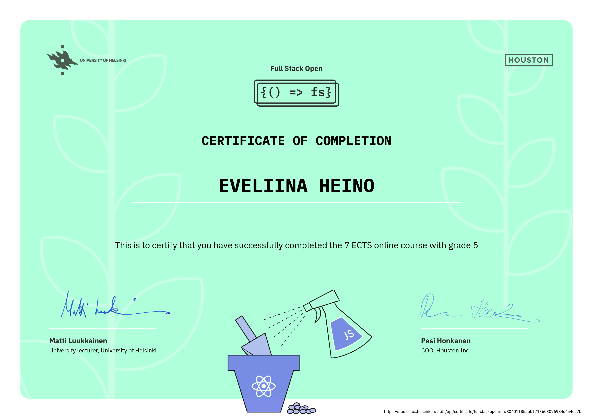

### Hi there! 👋

I'm Eveliina.

* Currently: Software Engineering Student at Metropolia University of Applied Sciences
### 📁 My projects

#### Fullstack:  
React, Express, Redux, GraphQl, Node...

* [Blogs](https://github.com/eveliinah/blogs-app)
* [Library](https://github.com/eveliinah/library-app)

#### Web:  
CSS, HTML, JavaScript, apis...
* [Outdoor Activities Map](https://github.com/eveliinah/outdoor-app)

### 🎖️ Certificate

<!--
**eveliinah/eveliinah** is a ✨ _special_ ✨ repository because its `README.md` (this file) appears on your GitHub profile.

Here are some ideas to get you started:

- 🔭 I’m currently working on ...
- 🌱 I’m currently learning ...
- 👯 I’m looking to collaborate on ...
- 🤔 I’m looking for help with ...
- 💬 Ask me about ...
- 📫 How to reach me: ...
- 😄 Pronouns: ...
- ⚡ Fun fact: ...
-->
